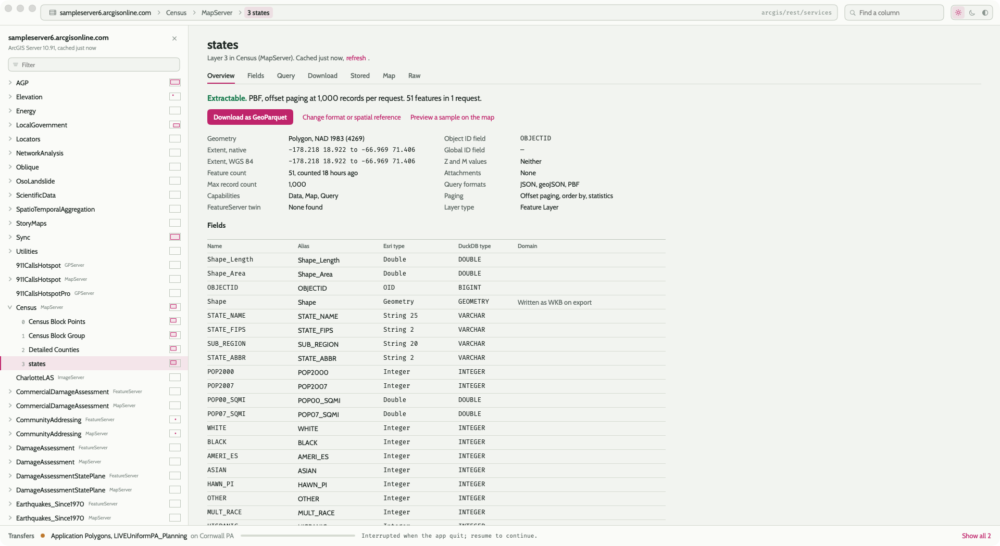
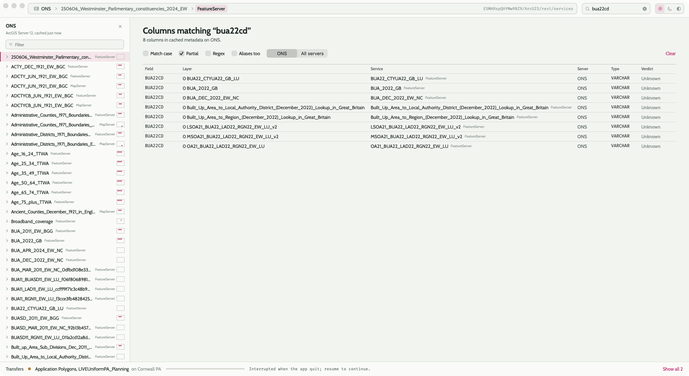
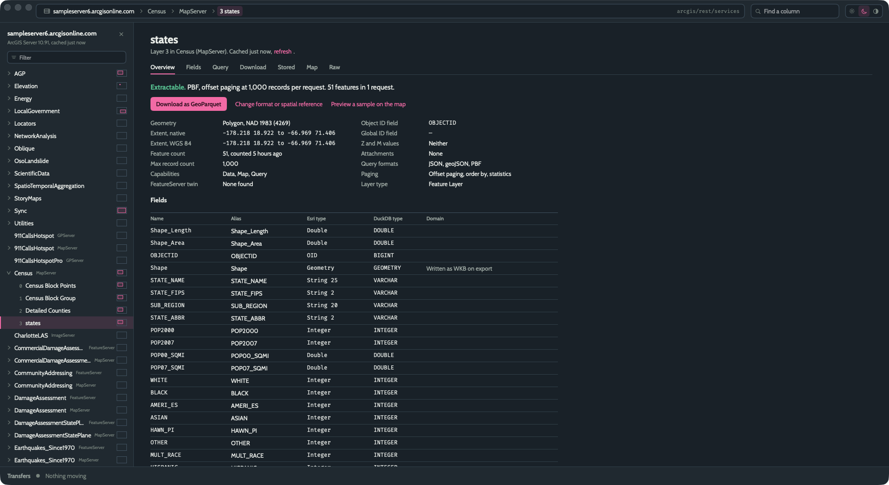
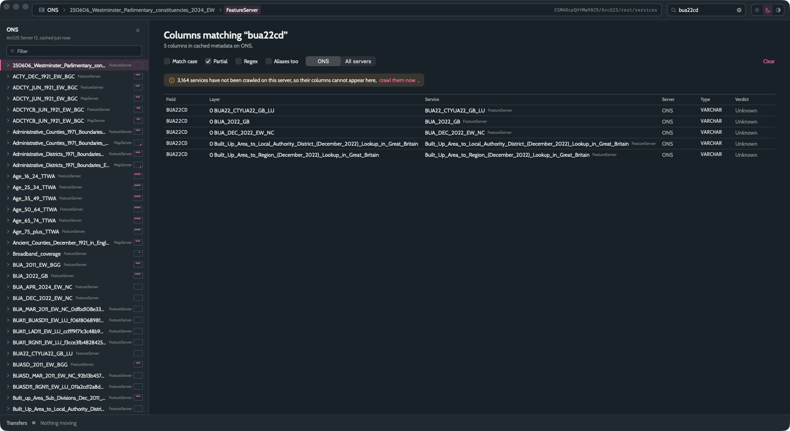

# Rumen

**Get the whole layer out of any map server, without their software.**

Paste a URL — ArcGIS REST, WMS, WFS or WMTS — and see what the server really holds, get a
straight answer to "can I extract this layer?", poke at it with read-only queries, and pull
it down in full as GeoParquet (or GeoJSON, or CSV) through the fastest transport the server
offers. A native macOS app in Swift and SwiftUI, with DuckDB as its spatial engine.

ArcGIS is the deep path: the whole hierarchy, querying, PBF, and paging chosen per layer.
OGC endpoints open alongside it — what is there, what it looks like, and a download where
the protocol has one.

*A rumen is the stomach that lets a cow digest what nothing else can.*



## What it does

- **Opens anything in the hierarchy.** A services root, a folder, a MapServer or
  FeatureServer, a single layer, even a `/query` URL someone sent you. It works out where
  that points, registers the server, crawls what it needs, and lands you on the node.
- **Finds the server behind a proxy.** A URL with no `rest/services` in it is not refused on
  sight. It is asked what it is, so a council portal that fronts one MapServer at
  `/planning/api/v1/Map/3` opens as that service, its layers, queries and downloads intact.
  Only a URL that answers as neither ArcGIS nor OGC is turned away, and it says what both
  attempts got. A proxy that wraps its answers in a JSON string is unwrapped, and one that
  routes only `GET` is met with `GET`.
- **Answers the question that matters first.** Every layer page opens with one sentence:
  *Extractable. PBF, offset paging at 2,000 records per request. 184,212 features in 93
  requests.* Or why not: a raster layer, no Query capability, a server that refused the
  count. When a MapServer layer has a FeatureServer twin with PBF or paging the MapServer
  lacks, the twin is found and used.
- **Downloads whole layers, correctly.** Esri's PBF where offered (decoded and dequantised
  in-app), Esri JSON otherwise, always `POST`. The pagination strategy is picked from the
  layer's capabilities (offset paging, OID ranges, OID lists) and falls back when a server
  lies about its limits. Pages that a server refuses are halved until they fit. Every
  request is recorded, so a run survives a crash, a quit, or a flaky server and resumes
  without refetching. Geometry becomes valid WKB with the Esri ring rules applied.
- **Writes files you can use.** GeoParquet by default, with real `geo` metadata: geometry
  types, bounding box, and the CRS as PROJJSON, so DuckDB, GeoPandas, and QGIS read it
  back typed and projected. GeoJSON (RFC 7946, so always WGS 84) and CSV with WKT too,
  at download time or as a re-export of a stored file that never touches the server.
- **Looks at what you fetched.** The Stored tab is a grid over the file, a DuckDB SQL
  scratch box with the file as the table `data`, row counts and sizes, and Show in Finder.
- **Finds columns across everything it has seen.** Column search runs over the cached
  fields of every layer on one server or all of them: partial, exact, regex, aliases.
- **Maps it.** MapLibre GL drawn as a survey sheet, with a graticule in the layer's own
  spatial reference and eastings and northings in the margins for projected layers. A
  bounded server sample, a stored file (with a DuckDB `where` box), or a query preview.
- **Remembers.** Every server you have opened, every crawl it has done, every download and
  export, all in a local SQLite database, so browsing and searching are instant and offline.
- **Opens OGC endpoints as well.** Paste a WMS, WFS or WMTS URL, vendor parameters and all
  (a UMN MapServer's `map=` stays put), and the endpoint is asked for all three. A WFS type
  downloads through GetFeature, GeoJSON or GML, paged when the server pages, into the same
  formats. A WMS layer downloads features when its GetMap speaks GeoJSON or through the WFS
  type of the same name, and can always be saved as a picture of its extent. A WMTS layer is
  listed and drawn. No querying: that is what the ArcGIS side is for.



## Read-only by construction

The app only ever calls `query`, the metadata endpoints, and `generateToken`. There is no
code path that writes to a server. Every request carries an `Origin` and a `Referer` set to
the server's own origin (overridable per server), and a raw `Cookie` header can be sent
verbatim, like curl's `-b`, for servers behind a session wall. ArcGIS token sign-in is
planned but not built yet; OAuth is not in scope.

## Install

Download the DMG from the [latest release](https://github.com/tbbuck/rumen/releases/latest),
drag the app to Applications, and open it. The app is signed with a Developer ID and
notarised, so macOS shows only its usual "downloaded from the internet" prompt.

Requirements: macOS 26 on Apple silicon. Nothing else to install: DuckDB is bundled, and
the `spatial` extension is fetched once on first launch into
`~/Library/Application Support/Rumen/duckdb-extensions` (this needs the network).

### Basemap tiles

The map's basemap comes from MapTiler and needs a key, which the app reads from the
`MAPTILER_API_KEY` environment variable at run time. Nothing is baked into the release.
For an app launched from the Dock, tell launchd:

```
launchctl setenv MAPTILER_API_KEY your_key_here
```

That lasts until you log out; a LaunchAgent makes it permanent. Without a key the map
still works, over a blank background, and says so.

## Using it

1. Press ⌘L, or click the path bar, and paste any map-server URL: ArcGIS REST, WMS, WFS or
   WMTS. The URL is asked what it is rather than assumed, so a council portal that fronts a
   MapServer behind its own path opens as that service. A new server is registered with a
   friendly name and listed to the bottom of its folders.
2. The tree on the left is the server: folders, services, layers, tables, each with a small
   locator showing where its extent sits within the server's data. Arrow keys, Home and End,
   type-ahead, and Return all work. Drag the tree's right edge to resize it.
3. The layer page has seven tabs: **Overview** (the verdict, facts, fields), **Fields**,
   **Query** (where, fields, spatial reference, ordering; Count, Extent, Preview, Distinct,
   Statistics, each enabled only when the layer supports it), **Download** (format, spatial
   reference, domain labels, where clause, output path, a manual strategy only when the
   automatic one has failed), **Stored** (the file on disk), **Map**, and **Raw** (the
   layer JSON exactly as the server sent it).
4. Downloads run in the strip along the bottom; click it to open the transfers drawer,
   where each run shows its request grid, rate, and time left, and can be paused, resumed,
   retried, mapped, or re-exported.
5. ⌘F searches columns. ⌘, opens Preferences: download folder, default format and spatial
   reference, domain labels, requests per host, retry limit, appearance.

Files land in `~/Documents/Rumen/<server>/<service>/<layer>.parquet` by default,
and an existing file is never overwritten without asking.

## Building from source

- Xcode 26 and macOS 26.
- Homebrew's DuckDB (`brew install duckdb xcodegen`); the package links `libduckdb` from
  `/opt/homebrew/opt/duckdb/lib` in development.
- The `spatial` extension under `~/.duckdb/extensions` (DuckDB installs it on first use).

```
swift test                                   # the engine and kit, headless
xcodegen generate && open Rumen.xcodeproj
```

For basemap tiles in a development build, create the untracked `Config/maptiler.local.xcconfig`
containing `MAPTILER_API_KEY = your_key_here`; it flows into the app's `Info.plist`. No key
is ever committed.

The repository's design and engineering notes: [SPEC.md](SPEC.md) (product and technical
spec, with the decisions log), [MILESTONES.md](MILESTONES.md) (the roadmap and what each
milestone found on the way), [UI-SPEC.md](UI-SPEC.md) and [DESIGN-TOKENS.md](DESIGN-TOKENS.md)
(the Sheet design language: components, palette, type, sizing).

### Releasing

`scripts/release.sh` builds Release, bundles `libduckdb` into the app, signs it with a
Developer ID and the hardened runtime (the one entitlement is `disable-library-validation`,
for DuckDB's own signed extension), runs the signed binary's `--selftest`, notarises,
staples, and packages a DMG. `.github/workflows/release.yml` does the same on any `v*` tag
and attaches the DMG to a GitHub Release; the secrets it needs are listed at the top of it.

## Architecture in a paragraph

`RumenCore` is a Swift package with no UI: `SQLiteKit` (the app database and its numbered
SQL migrations), `DuckDBKit` (a thin wrapper over DuckDB's C API with an appender and
prepared statements), and `RumenKit` (URL normalisation, the ArcGIS REST client and the OGC
client beside it, the crawlers, the extractability rules, the PBF and JSON decoders,
geometry to WKB, the download planner and engine, the exporter). Both protocols share one
set of tables and one download pipeline, so a WFS type resumes exactly as a FeatureServer
layer does; the `ArcGIS`-prefixed files are the Esri half, `OGC.swift` and its neighbours
the other. The app target is SwiftUI, dropping to AppKit for the server
tree (`NSOutlineView`), the results grid (`NSTableView`), and the map (MapLibre GL in a
`WKWebView`). Network and database access live behind actors; the app database is SQLite,
and DuckDB is only ever the spatial and data engine.

## Night

The Sheet palette has a night side, following the system appearance or the toggle in the
title bar: the same paper-and-magenta language on blue slate.





## Third-party

- [DuckDB](https://duckdb.org) and its `spatial` extension (MIT).
- [MapLibre GL JS](https://maplibre.org) (BSD-3) with [MapTiler](https://www.maptiler.com) basemaps.
- [SwiftProtobuf](https://github.com/apple/swift-protobuf) (Apache-2.0), and Esri's
  `FeatureCollection.proto` from the [arcgis-pbf](https://github.com/Esri/arcgis-pbf)
  repository (Apache-2.0), vendored under `Sources/RumenKit/Proto`.
- The [Cabin](https://fonts.google.com/specimen/Cabin) and
  [Fira Code](https://github.com/tonsky/FiraCode) typefaces (SIL Open Font License), bundled.
